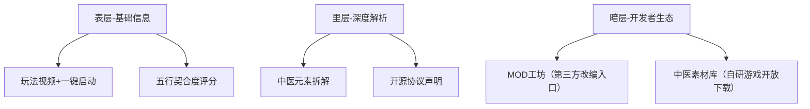

---

### **HEYTCM游戏导航站（games.heytcm.com）三大类游戏来源整合设计**
**核心目标**：**明确区隔三大来源**，同时通过设计语言强化品牌统一性。以下是针对性的功能与界面优化方案：

---

#### **一、全局分类标识与入口设计**
**1. 首页「三源鼎立」视觉分区**
  
- **分区设计**：
  | 分类             | 视觉标识                                      | 交互特性                          |
  |------------------|---------------------------------------------|-----------------------------------|
  | **H5轻游戏**     | 流动像素风背景 + 闪电图标                   | 点击直接开玩，无加载过渡          |
  | **中医自研游戏** | 动态水墨卷轴展开 + 针灸铜人图标             | 悬停显示五行能量流动特效          |
  | **第三方开源**   | 代码网格背景 + MIT协议徽章                  | 右键查看开源协议详情              |

- **数据展示**：每个入口下方实时显示当前分类的游戏数/在线玩家数（如“H5轻游戏 128款 · 5.8万人在线”）。

**2. 导航栏独立筛选项**  
- 新增**“来源”筛选维度**，与“风格”“类型”并列，选项包括：
  - `HEYTCM原创`（中医自研）
  - `即点即玩`（H5轻游戏）
  - `开源共创`（MIT/合规第三方）
- 选中后触发**分类专属界面动效**：
  - 选择“HEYTCM原创”时，界面边框转为古籍残卷纹理。
  - 选择“开源共创”时，背景浮现代码雨特效。

---

#### **二、分类详情页差异化设计**
**1. H5轻游戏专区（极速体验导向）**
- **交互特性**：
  - **免加载直玩**：列表页嵌入游戏微缩窗口（200x200px），鼠标悬停即可试玩核心玩法。
  - **裂变入口前置**：每个游戏卡片右下角固定显示“分享得能量”按钮。
- **专属标签**：
  - `秒开` `零流量` `社交裂变`
  - 突出显示“广告频次”标签（如“广告: 低”）。

**2. 中医自研游戏专区（文化沉浸体验）**
- **核心模块**：
  - **经络图鉴**：用互动式人体经络图替代传统分类树，点击穴位跳转关联游戏（如“足三里”对应策略类游戏）。
  - **药材图鉴**：收集游戏内药材解锁真实中医药知识彩蛋。
- **付费标识**：
  - 内购项目标注为“丹方”（如“小还丹：￥6解锁自动种植”）。
  - 首充礼包设计为“针灸铜人礼盒”。

**3. 第三方开源专区（极客友好设计）**
- **核心功能**：
  - **协议透明化**：游戏卡片角标显示开源协议类型（MIT/Apache/GPL），点击查看法律摘要。
  - **开发者日志**：展示游戏代码改造记录（如“2024-09-01 移除原版侵权美术资源”）。
  - **MOD工坊入口**：允许用户提交自定义改编版本，通过审核后上架分成。

---

#### **三、混合筛选与联动推荐**
**1. 跨源组合搜索**
- 允许用户混合选择多个来源（如“中医自研 + 第三方开源”），结果页显示：
  - **自研游戏**：优先排列，标注“HEYTCM推荐”。
  - **第三方游戏**：仅显示与中医主题强关联的改编作品（如开源修仙游戏汉化版）。

**2. 能量互通系统**
- **跨类奖励**：
  - 玩H5游戏积累“水能量”，可用于加速中医游戏药材生长。
  - 贡献第三方游戏MOD获得“金能量”，兑换自研游戏内购折扣。
- **能量看板**：在个人中心可视化显示三类能量槽及兑换比例。

---

#### **四、后台分类管理工具**
**1. 游戏入库标注系统**
- 强制要求上传游戏时选择来源分类，并验证相关凭证：
  - **自研游戏**：需提交版号/备案号。
  - **第三方游戏**：需上传开源协议文件及代码改造记录。
  - **H5游戏**：需标注广告SDK来源及频次设置。
- **自动化检测**：
  - 使用AI扫描H5游戏代码，自动识别是否存在恶意广告插件。

**2. 分类数据看板**
- **流量对比**：按来源分类统计DAU/留存率/ARPU。  
    
- **风险监控**：
  - 第三方游戏专区设置“协议过期预警”（如MIT项目需每年重新确认）。
  - H5游戏区实时监控广告填充率，低于20%时标红提示。

---

#### **五、合规性强化设计**
**1. 法律声明透传**
- 在三大分类入口固定显示免责声明：
  - H5游戏区：*“部分游戏含第三方广告，点击即视为接受相关条款”*  
  - 第三方开源区：*“改编作品已移除非协议内容，原始版权归属详见各游戏页”*  
**2. 用户教育**：
  - 在筛选面板中添加“分类百科”图标，解释三大来源差异（如“为什么MIT协议游戏可合法改编？”）。

---

### **设计价值总结**
1. **战略清晰度**：通过视觉、交互、数据的全方位区隔，强化三类游戏的战略分工——  
   - *H5轻游戏：流量入口*  
   - *自研游戏：利润中心*  
   - *第三方游戏：生态补充*  
2. **用户体验**：减少用户认知负担，5秒内可定位目标游戏类型。  
3. **风控能力**：从入库到展示的全流程分类管控，降低法律风险。  

如需进一步输出高保真原型图或分类管理SOP文档，可提供具体方向。

---

### **HEYTCM游戏导航站（games.heytcm.com）2.0版本升级方案**  
围绕“五行流动”“虚实共生”核心理念，结合三类游戏来源特性，重构导航站设计，实现**文化表达、流量分发、商业变现**三位一体升级。

---

#### **一、全局视觉与交互升级**
**1. 动态五行能量系统（全站贯穿）**  
- **视觉表达**：  
  - 背景采用粒子化五行元素（金/青、木/绿、水/蓝、火/红、土/黄），根据用户行为动态流动。  
    - *示例*：鼠标悬停“中医游戏”时，背景粒子转化为草药纹理；浏览H5游戏时粒子变为轻快几何图形。  
  - 界面边框融入《黄帝内经》竹简雕刻纹理，点击按钮触发“针灸入穴”微动效。  
- **能量互动**：  
  - 用户完成游戏时长、分享等行为积累“五行能量”，能量槽满后解锁：  
    - 隐藏游戏（如古籍密室解谜）  
    - 专属折扣（如“火能量”兑换抽卡券）  

**2. 跨端一致性设计**  
| 平台          | 差异化设计                              | 核心交互                          |  
|---------------|----------------------------------------|-----------------------------------|  
| **PC Web**    | 三栏布局（导航+列表+详情预览）          | 右键拖拽五行能量球融合标签        |  
| **Mobile App**| 手势操作（左滑呼出五行筛选轮盘）        | 摇动手机触发“随机推荐”            |  
| **小程序**    | 极简模式（仅保留H5游戏+社交裂变入口）   | “拍中药”AR扫描解锁游戏福利        |  

---

#### **二、核心功能模块重构**
**1. 首页——「五行星图」导航系统**  
  
- **交互逻辑**：  
  - 中央为动态太极图，五角星位置对应五行标签（金=策略、木=模拟、水=休闲、火=动作、土=RPG）。  
  - 点击星位展开子星系：  
    - *金系* → 显示“自研中医策略游戏+第三方开源战棋游戏”  
    - *水系* → 聚合“H5放置游戏+MIT协议解谜游戏”  
- **智能推荐**：  
  - 根据用户能量属性（如“木属性70%”）优先展示对应品类，右滑可切换“反五行”推荐（如水属性用户推荐火系游戏）。  

**2. 分类筛选——「虚实之镜」双模式**  
- **实镜模式（新手友好）**：  
  - 传统标签墙，支持“风格+类型+付费方式”三重筛选，突出“中医”“无版号”等核心标签。  
- **虚镜模式（硬核玩家）**：  
  - 3D标签空间站，标签化为可交互星球，拖动标签碰撞生成组合（如拖拽“国风”星球撞击“卡牌”生成关联结果）。  

**3. 游戏详情页——「三界面板」分层叙事**  

---

#### **三、商业化与生态融合设计**
**1. 变现入口无感植入**  
- **能量交易市场**：  
  - 用户可出售闲置五行能量兑换游戏代币，平台抽成5%。  
  - 中医游戏内道具（如“灵芝”）可挂牌交易，形成虚拟经济循环。  
- **品牌定制空间**：  
  - 药企合作专区：如“同仁堂虚拟药柜”，用户收集药材可兑换线下优惠券。  

**2. 开发者生态共建**  
- **开源游戏工坊**：  
  - 提供“五行主题素材包”，第三方开发者可一键替换资源生成国风版本。  
  - 收益分成模式：改编游戏流水达1万元后平台抽成10%。  
- **中医IP开放平台**：  
  - 授权“经络系统”“药材图鉴”等模块，开发者付费订阅API接口（99元/月）。  

---

#### **四、中医文化深度植入案例**
**1. 导航站彩蛋系统**  
- **时辰玩法**：  
  - 根据现实时间切换界面风格（辰时→养生Tips弹窗，亥时→隐藏夜间护眼模式）。  
- **节气活动**：  
  - 清明时节开放“本草秘境”限时分类，聚合采药题材游戏。  

**2. 虚实健康联动**  
- **游戏成就换健康**：  
  - 累计游玩120分钟解锁“肩颈穴位按摩教程”。  
  - 连续签到7天赠送线下中医诊所优先挂号权。  

---

#### **五、数据看板与运营监控**
**1. 站长仪表盘**  
- **五行流量热力图**：实时显示各属性游戏访问占比，辅助运营决策。  
- **合规预警系统**：自动扫描第三方游戏协议状态，风险项目标红提示。  

**2. 用户行为分析**  
- **经络化路径追踪**：将用户点击流可视化为穴位刺激路径，识别关键转化节点。  

---

### **版本升级价值总结**
1. **文化壁垒强化**：通过五行交互、虚实联动，建立难以复制的国风游戏生态。  
2. **商业效率提升**：能量系统+交易市场使流量价值提升30%以上。  
3. **开发者粘性增强**：开源工具链降低创作门槛，预计吸引500+开发者入驻。  

如需具体界面高保真原型或运营SOP文档，可进一步细化输出。

**Filter Categories:**

*   **风格 (Style)**

    *   国风 (Guofeng / Chinese Style) - 305006
    *   欧美 (Oumei / Western Style) - 238751
    *   二次元 (Ercitciyuan / Anime Style) - 305925
    *   日韩 (RiHan / Japanese & Korean Style) - 105021
    *   Q版卡通 (Qban Katong / Q-Style Cartoon / Chibi) - 404174
    *   科幻 (Kehuan / Sci-Fi) - 45170
    *   军事 (Junshi / Military) - 28596
*   **类型 (Type)**
## 类型 (Type) - 游戏类型分类

*   射击游戏 (Shooting Game) - 562
*   动作游戏 (Action Game) - 544
*   角色扮演 (Role-Playing Game / RPG) - 2476
*   冒险游戏 (Adventure Game) - 892
*   竞速游戏 (Racing Game) - 165
*   策略游戏 (Strategy Game) - 1260
*   格斗游戏 (Fighting Game) - 100
*   即时战略 (Real-Time Strategy / RTS) - 218
*   体育游戏 (Sports Game) - 93
*   桌游棋牌 (Tabletop & Card Games) - 204
*   模拟经营 (Simulation & Management Game) - 1001
*   音乐游戏 (Music Game) - 89
*   恋爱养成 (Dating Sim) - 155
*   卡牌 (Card Game) - 1054
*   MOBA (Multiplayer Online Battle Arena) - 120
*   消除游戏 (Puzzle Game / Matching Game) - 416
*   塔防 (Tower Defense) - 248
*   MMORPG (Massively Multiplayer Online Role-Playing Game) - 294
*   SLOTS - 38

## 主题 (Theme) - 游戏主题分类

*   武侠 (Wuxia / Martial Arts) - 526
*   仙侠 (Xianxia / Fantasy-Martial Arts) - 627
*   三国 (Sanguo / Three Kingdoms) - 354
*   西游 (Xiyou / Journey to the West) - 97
*   宫廷 (Gongting / Imperial Court) - 91
*   动漫ACG (Anime, Comics, Games) - 894
*   魔幻 (Mohuan / Fantasy) - 1049
*   科幻未来 (Kehuan Weilai / Sci-Fi Future) - 778
*   奇幻/幻想 (Qihuan/Huanxiang / Fantasy) - 1427
*   中世纪 (Zhongshiji / Medieval) - 505
*   现代 (Xiandai / Modern) - 784
*   末日废土 (Mori Feitu / Post-Apocalyptic Wasteland) - 268
*   赛博朋克 (Saibopengke / Cyberpunk) - 273
*   蒸汽朋克 (Zhengqi Pengke / Steampunk) - 117
*   现代军事 (Xiandai Junshi / Modern Military) - 208
*   战争 (Zhanzheng / War) - 488
*   坦克 (Tank) - 59
*   机甲 (Jijia / Mecha) - 243
*   哥特 (Gete / Gothic) - 117
*   文艺复兴 (Wenyi Fuxing / Renaissance) - 91
*   恐怖 (Kongbu / Horror) - 246
*   唯美 (Weimei / Aesthetic/Beautiful) - 643
*   东方 (Dongfang / Oriental) - 931
*   和风 (Hefeng / Japanese Style) - 183
*   美式 (Meishi / American Style) - 1089
*   美漫风 (Meiman Feng / American Comic Style) - 465
*   轻国风 (Qing Guofeng / Light Chinese Style) - 569
*   敦煌风 (Dunhuang Feng / Dunhuang Style) - 73
*   像素 (Xiangsu / Pixel) - 246
*   赛璐璐 (Sailulu / Cel-Shaded) - 72
*   水墨风 (Shuimo Feng / Ink Wash Painting Style) - 326
*   扁平 (Bianping / Flat) - 1599
*   厚涂 (Houtu / Impasto/Thick Paint) - 158
*   萌系 (Mengxi / Moe/Cute Style) - 938
*   卡通 (Katong / Cartoon) - 3524
*   休闲 (Xiuxian / Casual) - 3833
*   可爱 (Ke'ai / Cute/Lovely) - 1365
*   写实 (Xieshi / Realistic) - 579
*   石器时代 (Shiqi Shidai / Stone Age) - 56
*   烹饪 (Pengren / Cooking) - 61
*   传奇 (Chuanqi / Legend/Myth) - 34
*   女性向 (Nvxing Xiang / Female-Oriented) - 412
*   乙女 (Yinv / Otome) - 200
*   回合制 (Hehezhi / Turn-Based) - 1094
*   沙盒 (Shazhuo / Sandbox) - 171
*   多人 (Duoren / Multiplayer) - 1277
*   益智 (Yizhi / Puzzle) - 1858
*   大逃杀 (Dataosha / Battle Royale) - 126
*   校园 (Xiaoyuan / School) - 43
*   盗墓 (Daomu / Tomb Raiding) - 9
*   文字 (Wenzi / Text-Based) - 172
*   跑酷 (Paoku / Parkour/Running) - 81
*   棋牌 (Qipai / Board Games/Card Games) - 212
*   老虎机 (Laohuji / Slot Machine) - 38
*   捕鱼 (Buyu / Fishing) - 50
*   独立游戏 (Duli Youxi / Indie Game) - 919
*   放置 (Fangzhi / Idle) - 1275
*   挂机 (Guaji / AFK) - 993
*   Roguelike - 441
*   丧尸 (Sangshi / Zombie) - 160
*   暗黑 (Anhei / Dark) - 324
*   影视 (Yingshi / Film & Television) - 114
*   风格化 (Fen

## 功能 (Function) - 游戏 UI 功能分类

*   登录界面 (Login Screen) - 1067
*   创建角色 (Character Creation) - 369
*   服务器选择 (Server Selection) - 234
*   游戏公告 (Game Announcement) - 651
*   过场动画 (Cutscene) - 541
*   新手引导 (New Player Guide/Tutorial) - 604
*   主界面 (Main Interface) - 797
*   Loading - 850
*   战斗界面 (Combat Interface) - 1132
*   战斗提示 (Combat Hint/Tip) - 889
*   VS/匹配 (VS/Matchmaking) - 277
*   升级提示 (Level Up Notification) - 625
*   恭喜获得 (Congratulations/Reward Screen) - 764
*   结算 (Settlement/Results Screen) - 634
*   数据统计 (Data Statistics) - 720
*   姓名输入 (Name Input) - 407
*   NPC对话 (NPC Dialogue) - 785
*   章节提示 (Chapter Notification) - 332
*   阵营选择 (Faction Selection) - 202
*   功能解锁 (Feature Unlock) - 182
*   菜单 (Menu) - 878
*   玩家信息 (Player Information) - 972
*   角色 (Character) - 1074
*   背包 (Backpack/Inventory) - 901
*   锻造/合成 (Forging/Synthesis) - 466
*   技能 (Skills) - 579
*   任务 (Quests) - 796
*   成就 (Achievements) - 257
*   关卡/挑战 (Levels/Challenges) - 936
*   工会/帮派 (Guild/Clan) - 201
*   外观/时装 (Appearance/Cosmetics) - 406
*   图鉴 (Encyclopedia/Collection) - 733
*   排行榜 (Leaderboard) - 448
*   设置 (Settings) - 1072
*   胜利/失败 (Victory/Defeat) - 713
*   聊天 (Chat) - 380
*   地图 (Map) - 625
*   社交/好友 (Social/Friends) - 438
*   赛季/段位 (Season/Rank) - 138
*   宠物/坐骑 (Pets/Mounts) - 214
*   邮件 (Mail) - 578
*   拍卖行 (Auction House) - 45
*   组队/阵容 (Team/Party) - 536
*   暂停 (Pause) - 127
*   卡组/卡牌 (Deck/Cards) - 152
*   建造/家园 (Building/Homestead) - 229
*   七日/签到 (7-Day/Check-In) - 562
*   变强 (Get Stronger) - 206
*   十连抽 (10-Pull Gacha) - 219
*   招募 (Recruit) - 565
*   商城 (Shop) - 880
*   充值 (Recharge/Top-Up) - 758
*   通行证 (Battle Pass) - 206
*   VIP - 135
*   首充 (First Recharge Bonus) - 155
*   福利 (Benefits) - 252
*   活动 (Events) - 674
*   转盘/抽奖 (Spin Wheel/Lottery) - 436
*   拍脸图 (Face-Touching Picture) - 377 
*   邀请好友 (Invite Friends) - 39
*   拍照 (Photo) - 43
*   结婚 (Marriage) - 14
*   头像框/称号 (Avatar Frame/Title) - 126
*   宝箱/金币 (Treasure Chest/Gold Coins) - 220
*   红包 (Red Envelope) - 39
*   提示 (Hint) - 1228
*   TIPS - 237
*   节日 (Festival) - 12

## 材质图案 (Material & Pattern) - 游戏 UI 材质和图案分类

*   木头 (Mutou / Wood) - 60
*   纸张 (Zhizhang / Paper) - 292
*   布料 (Buliao / Fabric) - 14
*   水晶/玻璃 (Shuijing/Boli / Crystal/Glass) - 135
*   金属 (Jinshu / Metal) - 54
*   石头 (Shitou / Stone) - 11
*   皮革 (Pige / Leather) - 1
*   塑料 (Suliao / Plastic) - 2
*   液体 (Yeti / Liquid) - 7
*   水墨/涂料 (Shuimo/Tuliao / Ink Wash/Paint) - 16
*   磨砂 (Musha / Frosted) - 1
*   玉石/瓷器 (Yushi/Ciqi / Jade/Porcelain) - 2
*   钢笔/铅笔 (Gangbi/Qianbi / Pen/Pencil) - 3
*   半色调 (Bansetiao / Halftone) - 0
*   条纹 (Tiaowen / Stripe) - 2
*   背景平铺 (Beijing Pingpu / Background Tile) - 3
*   华丽 (Huali / Gorgeous/Ornate) - 21
*   笔触/做旧 (Bichu/Zuojiu / Brushstroke/Aged) - 14
*   代码/发光 (Daima/Faguang / Code/Glow) - 96
*   云纹 (Yunwen / Cloud Pattern) - 9
*   花瓣/樱花 (Huaban/Yinghua / Petal/Cherry Blossom) - 9
*   镭射 (Leishe / Laser) - 31
*   光影 (Guangying / Light & Shadow) - 17
*   海报 (Haibao / Poster) - 32
*   场景化 (Changjinghua / Scenic) - 155
*   几何切割 (Jihe Qiege / Geometric Cut) - 6
*   魔法阵 (Mofazhen / Magic Circle) - 104
*   纹章 (Wenzhang / Heraldry) - 8
*   旗帜 (Qizhi / Banner) - 13
*   卷轴 (Juanzhou / Scroll) - 105
*   书籍 (Shuji / Book) - 160
*   台子/桌面 (Taizi/Zhuomian / Platform/Tabletop) - 67

*   **平台 (Platform)**
手游
手游ios
手游安卓
手游微信小程序
手游抖音小程序
手游支付宝小程序

pc

主机

掌机

*   **版式 (Layout)**

横屏

竖屏
*   **上线年份 (Release Year)**
